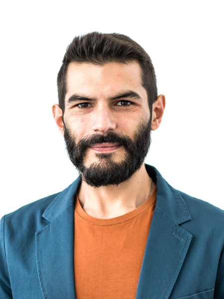

<h1> Ivan Palmegiani, MSc </h1>

**<ivan.palmegiani@gmail.com> | [LinkedIn Account][2d6409ca]  |  [GitHub Account][e3281462]**   
Address and phone number available on request

  [2d6409ca]: https://www.linkedin.com/in/ivan-palmegiani-13a4a15b/ "My_LinkedIn"
  [e3281462]: https://github.com/IvanPalm "My_GitHub"

  
  

<h2> Profile </h2>

Researcher with cross-disciplinary expertise extending from ecology and natural sciences to machine learning. Proponent of nature-based solutions for climate change adaptation and mitigation, well informed on environmental technology. Capable of knowledge-transfer and data translation. Team player, also able to take charge of tasks individually. Constructive critical thinker. Highly motivated and positive towards challenges. Strong analytical mindset and excellent organization skills. Solution oriented and careful about details. Curious and eager to learn.

<h3> Technical expertise </h3>

Python programming | R coding | Geographic Information System - QGIS | Relational (geo)databases - PostgreSQL-PostGIS | Remote Sensing | Machine Learning | Geodata analytics | Time series analyses | Data visualization | Data reporting

<h3> Languages </h3>

English - IELTS certification level C1 • German - TELC certification level B1 • Italian - mother tongue • Spanish - fluent • Portuguese - fluent

<h2> Professional Experience </h2>

**Environmental Researcher | (Geo)Data Scientist**, Nov. 2019 - Present  
[SmartCloudFarming GmbH (DE)][2dg5i84s]  
Development of ML models for the estimation of soil water content till 90 cm depth by integrating satellite data and ground measurements - Contribution to the development of DL models for the estimation of soil organic carbon from satellite data - Content crafting for funding applications

[University of Primorska (SL)][bv7kewda]  
Development of functional solutions for data storage in relational databases - Data query - Consulting on wildlife data management

[EarthRatings UG (DE)][sf46gh40]  
Search and Web Crawling of Corporate Environmental Footprint (CEF) and Social Responsibility (CSR) data - Data cleaning and preparation - Exploratory data analyses - Feature Engineering

**Professional re-qualification**, Oct. 2018 - Nov. 2019  
Intensive technical training | German language course | Conflict management and non-violent-communication (NVC) self-training | Personal development

**PhD Candidate**, May 2014 - Jun. 2018 | **Research Assistant**, Apr. 2013 - Sept. 2013  
[IZW - Leibniz Institute for Zoo and Wildlife Research (DE)][bb58fb82]  
Main goal: Investigating the social system of the cheetah in central Namibia.  
- Collected, processed and analyzed time series of geo-referenced data from satellite telemetry
- Performed spatial and movement analyses on GPS tracking data
- Modelled the use of space by individuals with linear and nonlinear regression models
- Collected and analyzed presence-absence data via camera-trap surveys
- Designed and maintained online and offline (geo)databases
- Engaged with stakeholders, and made scientific results accessible to them through public talks, data reports and visualizations
- Coordinated data collection in the field, supervised volunteers
- Organized scientific symposia  

**Research Assistant**, Dec. 2012 - Feb. 2013 | **Research Technician**, Feb. 2012 - Nov. 2012    
[CIBIO - Research Center in Biodiversity and Genetic Resources (PT)][87111420]  
Main goal: Investigating the spatial ecology of endangered wildlife species in the Iberian peninsula (Portugal and Spain).  
- Collected and analyzed satellite telemetry and geo-referenced environmental data
- Modelled species distribution in relation to environmental variables using linear and nonlinear regression models
- Designed and maintained relational (geo)databases
- Engaged with stakeholders, and made scientific results accessible to them through public talks, data reports and visualizations  

**Research Technician**, Nov. 2010 - Nov. 2011  
[Department of Zoology and Evolutionary Genetics, University of Sassari (IT)][09879b80]    
Main goal: Investigate spatial distribution, abundance and reproductive success of wolves in central Italy.  
- Collected geo-referenced environmental data
- Collected and analyzed bio-acoustic data
- Collected and analyzed presence-absence data via camera-trap surveys

  [2dg5i84s]: https://smartcloudfarming.com/ "SCF"
  [sf46gh40]: https://www.earthratings.com/ "ERs"
  [bv7kewda]: https://www.famnit.upr.si/en/ "UniPRIS"
  [bb58fb82]: http://www.izw-berlin.de/welcome.html "IZW"
  [87111420]: https://cibio.up.pt/ "CIBIO"
  [09879b80]: https://en.uniss.it/ugov/person/2348 "UniSS"

<h2> Education </h2>

<h2> Education </h2>

**Master of Science (MSc)**, Jul. 2010  
*Environmental Sciences and Natural Resources Management*, University of Sassari. Grade: 110/110 *cum Laude*  
Environmental modelling, statistical inference, advanced statistical theory, zoocenosis and wildlife conservation, wildlife management, genetics, plant conservation, environmental economics, systems ecology, landscape ecology, regional geology, sedimentology.

<h3> Hobbies and interests </h3>  
Cooking • Indoor gardening • Tai Chi • Outdoor sports and activities such as climbing, bouldering, hiking, biking, canoeing, camping • DIY and Handicraft • Music and Arts • Urban agriculture
